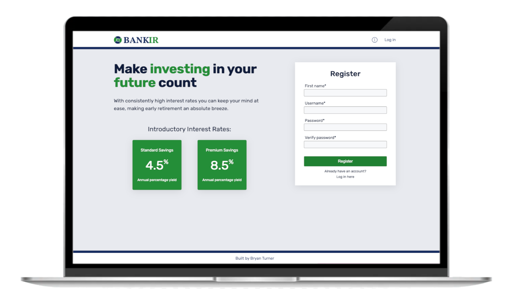

# BankIR Simulated Banking Back-end

Users can register and log in with personal accounts. They can practice making transactions, transfers and earning interest for educational purposes. To view the front-end code used for this project, click [here](https://github.com/bryturner/bankir-fe).

## Technologies

- JavaScript
- MongoDB
- Node.js
- Async/await
- RESTful API

## Possible Features

- Restrict users from making multiple transactions/transfers at the same time on different devices. MongoDB provides this service, but it is above the tier I’m using.
- Automatically update the accounts every month by adding earned interest
- Enabling users to set up automatic transfers/transactions

## Author

**Bryan Turner**

- [My LinkedIn Profile](https://www.linkedin.com/in/bryanturnerdev/)
